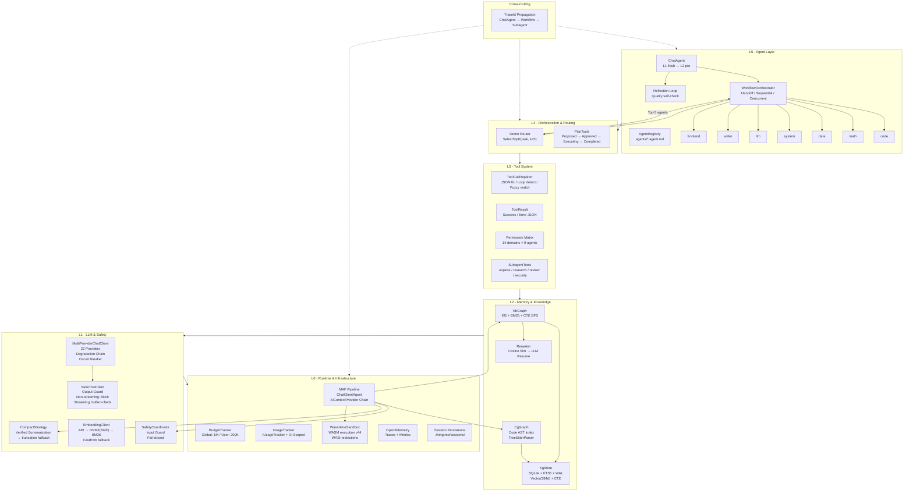

# LTAI 架构文档

## 六层架构图



## 层间合约

| 层 | 职责 | 消费 | 被消费 |
|----|------|------|--------|
| L5 Agent | 用户交互、任务路由 | L4 Orchestration | UI (TUI/Desktop/CLI) |
| L4 Orchestration | Agent 编排、向量路由 | L3 Tools + L5 Agents | L5 Agent |
| L3 Tool System | 工具执行、权限控制 | L2 Memory | L4 Orchestration |
| L2 Memory | 知识/代码图谱、语义检索 | L1 LLM | L3 Tools |
| L1 LLM & Safety | LLM 路由、安全防护 | L0 Runtime | L2 Memory |
| L0 Runtime | MAF 管线、沙箱、监控 | - | 全层 |

## 数据流

```
User Input → ChatAgent → Budget Check → Safety Input Guard → KbGraph/CgGraph Context Injection
  → Compaction → WasmtimeSandbox → MultiProviderChatClient (LLM)
  → ToolCallRepairer (if tool call) → Tool Execution → ToolResult
  → SafeChatClient Output Guard → Reflection Loop → Response
```

## 关键设计决策

| 决策 | 选择 | 理由 |
|------|------|------|
| Agent 路由 | LLM + 向量预选 | 20+ Agent 时 prompt 不膨胀 |
| 知识图谱 | SQLite FTS5 + CTE | 零运维、单用户够用 |
| 沙箱 | Wasmtime v44 | 成熟度 (129万下载) > Hyperlight (v0.4) |
| 上下文压缩 | LLM 摘要 + 验证 | 防幻觉累积 |
| UsageTracker | 静态 API + DI 接口 | 不改旧代码，增量支持多租户 |
| 会话持久 | .livingtree/sessions/ | 进程重启不丢上下文 |
