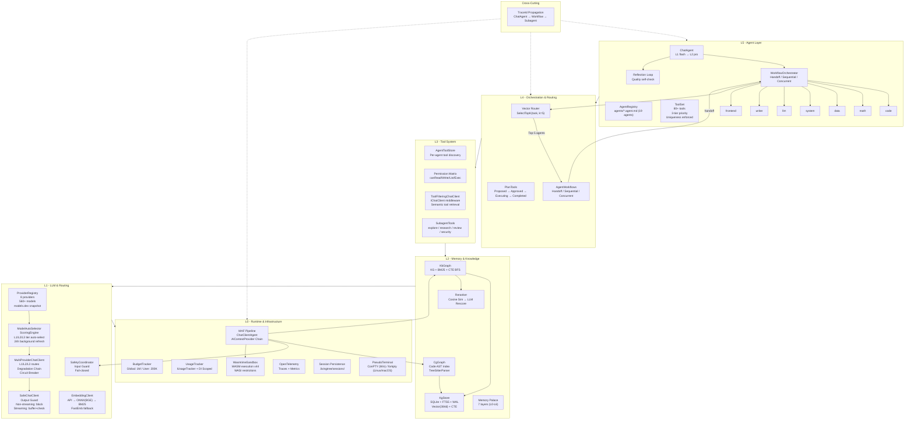

# LTAI 架构文档

## 六层架构图



## 层间合约

| 层 | 职责 | 消费 | 被消费 |
|----|------|------|--------|
| L5 Agent | 用户交互、任务路由、工具注册 | L4 Orchestration | UI (TUI/Desktop/CLI) |
| L4 Orchestration | Agent 编排、向量路由 | L3 Tools + L5 Agents | L5 Agent |
| L3 Tool System | 工具执行、权限控制、语义工具检索 | L2 Memory | L4 Orchestration |
| L2 Memory | 知识/代码图谱、语义检索、记忆宫殿 | L1 LLM | L3 Tools |
| L1 LLM & Routing | Provider 注册、模型自动选拔、LLM 路由、安全防护 | L0 Runtime | L2 Memory |
| L0 Runtime | MAF 管线、沙箱、监控、跨平台 PTY | - | 全层 |

## 数据流

```
User Input → ChatAgent → Budget Check → Safety Input Guard → KbGraph/CgGraph Context Injection
  → Memory Palace (7 layers) → ToolFilteringChatClient → Compaction
  → MultiProviderChatClient (L1 auto-selected model)
  → ToolCall Repairer (if tool call) → Tool Execution (via ToolSet)
  → ToolResult → ToolFilteringChatClient (semantic re-selection)
  → SafeChatClient Output Guard → Reflection Loop
  → L1 quality inadequate → ModelAutoSelector escalates to L2
  → Full regeneration or FusionRoute (span-level) → Response
```

## 模型自动选拔流程

```
启动:
  DEEPSEEK_API_KEY=sk-xxx
  → ModelsDevClient: 读取 models/models-dev-providers.json
  → ProviderRegistry: 8 providers × 560+ models 注册到内存
  → ModelAutoSelector.SelectAsync():
      1. 用户配 L1 = deepseek-chat ✓
      2. L2 候选: deepseek-chat + deepseek-reasoner
         - deepseek-reasoner: ToolCall✓, Reasoning✓, 1M ctx → 评分 0.87
         - deepseek-chat: ToolCall✓, StructuredOutput✓, 1M ctx → 评分 0.72
         → 选中: deepseek-reasoner (alt: deepseek-chat)
      3. L3 候选: deepseek-chat → 选中 (唯一候选)
  → MultiProviderChatClient:
      l1 = OpenAIChatClient("deepseek-chat")
      l2 = OpenAIChatClient("deepseek-reasoner")
      l3 = OpenAIChatClient("deepseek-chat")

运行时:
  Agent 发请求 modelId=l1 → MultiProviderChatClient 路由到 deepseek-chat
  如果 3 次连续失败 → circuit breaker → 尝试 l2 → deepseek-reasoner
  后台 24h: ModelsDevClient.RefreshFromApiAsync() → 更新 models-dev-providers.json

CLI 覆盖:
  ltai models set l2 gpt-4o-mini  → 跳过 L2 自动选拔，使用配置值
  ltai models auto l2             → 恢复自动选拔
```

## 关键设计决策

| 决策 | 选择 | 理由 |
|------|------|------|
| **Provider 元数据** | models.dev API + 本地缓存 | 零硬编码，8 provider 自动发现，500+ 模型能力已知 |
| **模型选拔** | 综合评分 (能力/成本/速度/可用) | 用户只需配 API Key，全自动 |
| **工具唯一性** | ToolSet 字典 (Core > Domain > External) | MCP 外部工具无法覆盖 LTAI 原生工具 |
| **工具过滤** | IChatClient 中间件 (ToolFilteringChatClient) | 运行在所有 AIContextProvider 之后，替换旧 AIContextProvider 方案 |
| **Agent 路由** | LLM + 向量预选 | 19+ Agent 时 prompt 不膨胀 |
| **伪终端 (Desktop)** | Windows ConPTY + Linux/macOS forkpty | 跨平台终端支持 |
| **知识图谱** | SQLite FTS5 + CTE | 零运维、单用户够用 |
| **沙箱** | Wasmtime v44 | 成熟度 (129 万下载) > Hyperlight (v0.4) |
| **上下文压缩** | LLM 摘要 + 验证 | 防幻觉累积 |
| **会话持久** | .livingtree/sessions/ | 进程重启不丢上下文 |
