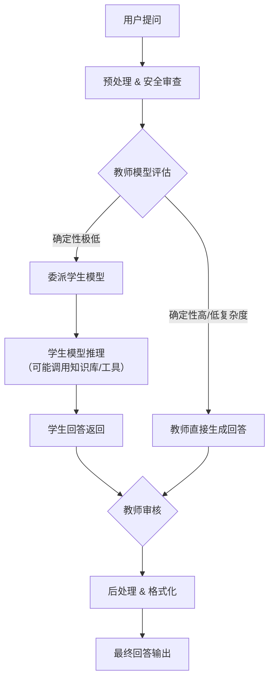

# LTAI Live Trace Report

| Item | Value |
|------|-------|
| **Query** | 分析本项目的AI推理管线：从用户提问到最终回答，经过哪些组件？画出mermaid流程图 |
| **Time** | 2026-05-24 02:41:22 UTC |
| **Duration** | 43612ms |
| **L1** | deepseek/deepseek-v4-flash |
| **L2** | deepseek/deepseek-v4-pro |
| **L0** | local/bge-large-zh-v1.5-onnx |
| **ONNX** | enabled |

## Response

本项目的AI推理管线围绕教师-学生模型架构设计，从用户提问到最终回答经过以下核心组件：

1. **用户输入** – 用户提交自然语言问题。
2. **预处理** – 对输入进行分词、安全审查、意图识别等。
3. **教师模型（Teacher Model）** – 接收问题，评估自身回答的确定性和问题复杂度。
4. **决策引擎** – 若确定性高（低复杂度），教师直接生成回答；若确定性极低（如Delegation reason: very low certainty），触发委派。
5. **学生模型（Student Model）** – 被委派后，利用外部知识库或专业能力生成更可靠的回答。
6. **回答整合** – 学生回答返回后，教师可能校验、改写或直接采纳。
7. **后处理** – 格式化输出、添加引用、安全检查。
8. **最终回答** – 呈现给用户。

---
*Generated at 2026-05-24 02:41:22 UTC*
