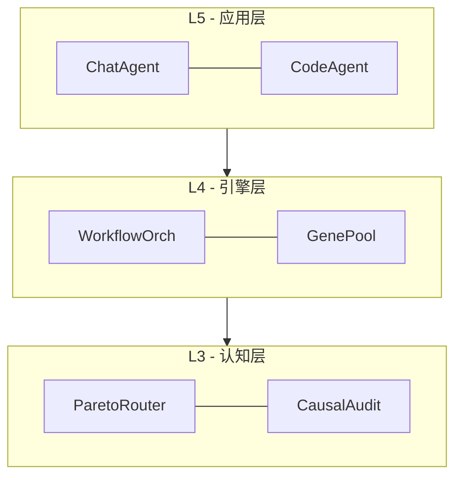

# Architecture Diagram Skill

使用 Flowchart 工具（Mermaid）生成项目架构图并导出为 SVG。

## 工作流程

### 1. 分析项目结构
读取关键配置文件（`*.csproj`, `Directory.Build.props`）和源码目录结构，了解：
- 项目分层架构
- 组件/模块依赖关系
- 部署拓扑

### 2. 选择图表类型

| 类型 | 适用场景 | Mermaid 语法 |
|------|----------|-------------|
| **分层图** | 六层架构、洋葱架构 | `flowchart TB` 自上而下分层 |
| **组件图** | 模块依赖、服务调用 | `flowchart LR` 左右布局 |
| **部署图** | 服务拓扑、网络架构 | `flowchart TB` + 子图分组 |

### 3. 生成架构图 Mermaid 代码

分层图示例：


### 4. 导出 SVG
调用 `Flowchart` 工具时设置 `renderSvg: true`，SVG 文件保存到 `docs/` 目录。

## 使用示例

```
用户：生成 LTAI 项目的架构图
AI：读取项目结构 → 按六层组织 → Flowchart(renderSvg: true) → SVG 导出
```
