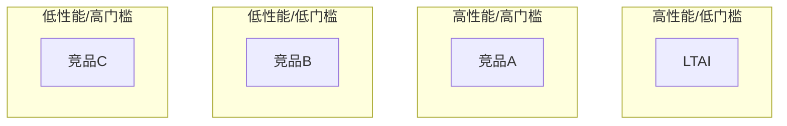

# Competitive Analysis Skill

生成竞品分析对比图，支持多种可视化形式，导出为 SVG。

## 工作流程

### 1. 数据收集
确定竞品名单和对比维度，例如：
- **功能维度**: 核心能力、API 支持、插件生态
- **技术维度**: 性能、可扩展性、语言支持
- **商业维度**: 定价、许可证、社区活跃度

### 2. 选择对比形式

| 形式 | 适用场景 | 实现方式 |
|------|----------|----------|
| **对比表格** | 功能点逐项对比 | Markdown 表格 + 评分 |
| **定位四象限** | 产品定位/市场分布 | `flowchart TB` 用坐标布局 |
| **能力雷达图** | 多维度评分对比 | Mermaid 饼图/环形图替代 |
| **堆叠对比** | 版本/套餐功能差异 | 表格 + 色块标注 |

### 3. 生成对比图

**对比表格**示例：
```
| 维度 | LTAI | 竞品A | 竞品B |
|------|------|-------|-------|
| 本地推理 | ✅ | ❌ | ✅ |
| 知识图谱 | ✅ | ✅ | ❌ |
| 多 Agent | ✅ | ✅ | ✅ |
| 开源 | ✅ (MIT) | ❌ | ✅ |
```

**定位四象限图** Mermaid 示例：


### 4. 导出
- 对比表格直接 Markdown 输出
- 图表调用 `Flowchart(renderSvg=true)` 导出 SVG
- 推荐输出到 `docs/comparison/` 目录

## 使用示例

```
用户：分析 LTAI 与 Semantic Kernel、AutoGen 的竞品对比
AI：确定对比维度 → 表格对比 → 定位图 → 导出 SVG
```
